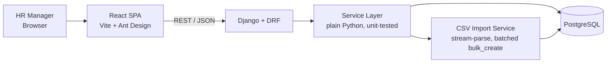
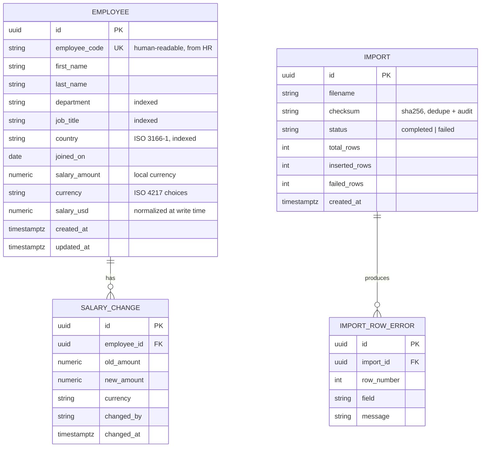

# Architecture — ACME Salary Management

**Author:** Kunal Kejriwal · **Status:** Living document · **Scope:** Take-home assessment (Incubyte)

This document explains what the system looks like, why each decision was made, and what was deliberately *not* built. Companion docs: `REQUIREMENTS.md` (scope), `DECISIONS.md` (trade-off log), `AI_USAGE.md` (AI workflow).

---

## 1. System Overview

A single-tenant web application for ACME's HR manager to manage salary data for ~10,000 employees across multiple countries, replacing an Excel-based workflow.



**Principle applied throughout: simplest architecture that honestly serves the load.** 10,000 employees is small data. Every component below exists because the product needs it — scaling paths are documented (§9), not pre-built.

---

## 2. Stack & Rationale

| Layer | Choice | Why |
|---|---|---|
| Backend | Python 3.12, Django 5 + Django REST Framework | Matches the role; batteries included — ORM, migrations, auth, and admin come from one coherent framework instead of assembled parts |
| Database | PostgreSQL (SQLite for tests) | Real aggregates (percentiles, window functions) power analytics; Django's test runner spins up SQLite for a fast, dependency-free suite |
| Frontend | React 18 + Vite + TypeScript | Matches the role; fast dev loop |
| Components | Ant Design | Data-dense HR UI: Table with server-side pagination/sort/filter, Upload, and charts (`@ant-design/plots`) out of the box |
| Deployment | Docker Compose → Railway (API + DB), Vercel (SPA) | Public URL with minimal ops surface |

A deliberate side benefit of Django: the **built-in admin** gives a zero-cost back-office view over employees, imports, and the salary audit trail — useful for reviewers to inspect data without touching the DB.

---

## 3. Data Model



Key modeling decisions:

- **Money is `DecimalField`, never float.** Non-negotiable for salary data.
- **Dual salary storage** — `salary_amount` + `currency` is the source of truth; `salary_usd` is computed at write time from a static FX table (`fx_rates` seeded in-repo). This makes every cross-country aggregate a plain ORM aggregation with no join-time conversion, at the cost of a documented staleness trade-off (§9).
- **`salary_change` is an append-only audit trail**, written by the service layer on every salary update. HR/compliance value at near-zero cost.
- **`import` + `import_row_error`** give migration auditability ("what was loaded, when, what failed and why") without external file storage.

---

## 4. API Design

REST via DRF, versioned under `/api/v1`, browsable API in dev, OpenAPI schema via `drf-spectacular`.

| Endpoint | Purpose |
|---|---|
| `GET /employees` | Server-side pagination, ordering, and filters (`country`, `department`, `currency`, salary range, free-text search) via `django-filter` |
| `POST /employees` · `GET/PUT/DELETE /employees/{id}` | CRUD; salary updates append to `salary_change` |
| `GET /employees/{id}/salary-history` | Audit trail for one employee |
| `POST /imports` **(stretch)** | CSV upload → validate → batched insert → returns the full import report (id, counts, errors) |
| `GET /imports/{id}` **(stretch)** | Re-fetch a past import's report |
| `GET /imports/{id}/errors.csv` **(stretch)** | Downloadable per-row error report |
| `GET /exports/employees.csv` | Filtered export (round-trip back to Excel) |
| `GET /analytics/summary` | Headcount, total/avg/median cost (USD) |
| `GET /analytics/by-country` · `/by-department` · `/by-title` | Avg, median, p10/p90 salary + headcount per group |
| `GET /analytics/distribution` | Salary histogram buckets (USD) |

The API is UI-agnostic by design — a future payroll/HRIS integration or employee self-service portal consumes the same endpoints.

---

## 5. CSV Import Pipeline — Stretch Scope

> **Stretch scope.** The Incubyte team confirmed bulk CSV import with row-by-row
> validation is not expected; a deterministic seed script covers the 10,000
> records instead (§7, F3). This section is retained as the design that would be
> built if time permits, and is deliberately the last thing attempted.

The one flow with real design tension. Chosen shape:

1. `POST /imports` receives the file and validates the header row (fail fast on wrong schema).
2. The service **stream-parses** the CSV (constant memory), validates each row (types, currency choices, non-negative salary, date format), and collects errors with row numbers.
3. Valid rows are inserted with **`bulk_create(batch_size=1000)`** — ~10 round trips for 10k rows instead of 10,000. The whole import completes in a few seconds, so the endpoint runs **synchronously** and returns the finished report; the UI shows a progress spinner during upload.
4. **Partial-import policy:** valid rows land, invalid rows go to `import_row_error`, and the HR manager gets "9,847 imported, 153 failed" with a downloadable error CSV. Friendlier for a real-world migration than all-or-nothing; policy is documented and trivially flippable (wrap in `transaction.atomic`).

Why synchronous, and why not Celery/SQS/S3: at this scale the job is a 2–5 second batched insert. Async processing in Django means a broker and worker processes — three deployable services, mocked tests, and operational surface to solve a problem that doesn't exist yet. The distributed evolution is specified in §9, including where a task queue becomes the right call.

Why validation errors are **not** dead-letter material: a malformed salary is deterministic — retrying reproduces it forever. DLQs are for transient/poison infra failures. Validation failures are *product data* the HR manager must see and fix, so they live in a queryable table with a download path.

---

## 6. Backend Structure

```
config/               # settings (base/dev/prod), urls, wsgi
apps/
  employees/          # models, serializers, views, filters, services.py
  imports/            # import service, models, error-report views
  analytics/          # aggregate queries behind service functions
  core/               # shared: fx_rates, currency choices, seed management command
  */tests/            # unit + API tests colocated per app
```

DRF views stay thin; business logic (import pipeline, audit writes, analytics queries) lives in `services.py` modules that take plain data and querysets. This is what keeps tests fast and the TDD loop tight. Seeding is a management command: `python manage.py seed --count 10000` with `Faker(seed=42)`.

---

## 7. Testing Strategy

Built test-first; commit history shows red → green → refactor.

- **Fast & deterministic:** `pytest-django` with SQLite test DB, `Faker(seed=42)` everywhere, no network, no sleeps. Full suite target: < 10 seconds.
- **Coverage priorities:** import validation (each rule + partial-import counts), currency normalization, analytics aggregates against small hand-computed fixtures, pagination/filter edges, salary-update audit writes.
- **API tests** via DRF's `APIClient` for contract-level checks; **frontend** gets targeted Vitest + Testing Library coverage on the employee table and import flow.
- One known trade-off: SQLite lacks `percentile_cont`, so percentile analytics use a portable expression tested against fixtures; a thin CI job can run the same suite against Postgres.

---

## 8. Performance Considerations

- **Server-side pagination everywhere** — the browser never receives 10k rows.
- **Indexes** on `country`, `department`, `job_title`, `(last_name, first_name)`, `employee_code`; analytics group-bys hit indexed columns. `select_related`/`only` where list views need it.
- **Batched writes** for import (§5).
- **Seed realism:** salaries drawn log-normal per country/level so distributions and dashboards look like a real org, not `uniform(30k, 200k)`.
- At 10k rows, every aggregate in §4 runs in single-digit milliseconds on Postgres; no caching layer is warranted (see §9 for when it would be).

---

## 9. Deliberately Out of Scope — and the Evolution Path

| Not built | Why | When it becomes right |
|---|---|---|
| Celery + broker (async import) | 3-service overhead for a 3-second job | >1M rows or concurrent multi-file imports: presigned S3 upload → queue → workers → `202` + status polling; DLQ for infra failures only |
| Live FX rates | Static table is deterministic, testable, and honest for a demo | Real deployment: daily rate ingestion + effective-dated `fx_rates`, recompute `salary_usd` on rate change |
| Employee self-service | Brief specifies one persona (HR manager) | Add roles to Django's user model, `/me` endpoints on the same API |
| **Authentication, login, and RBAC** | **Scoped out by the Incubyte team.** The application is internal and the user is an already-authorized, single HR manager. Standing up a user model and a role matrix for one known operator is over-engineering | SSO/IdP at the edge (the app trusts an authenticated proxy), then Django groups and permissions enforced in the service layer once a second persona exists |
| Payroll execution / payslips | Managing salary data ≠ paying people | Separate bounded context; integrate via the existing API |
| Caching / read replicas | All queries are ms-fast at this scale | ~1M+ employees or heavy concurrent analytics |

---

## 10. Deployment

- **Local:** `docker compose up` — Postgres + API + SPA, migrated and seeded on first run.
- **Prod:** Railway (Gunicorn container + managed Postgres; `migrate` + `seed` as release command), Vercel (SPA). Environment-driven config (`DATABASE_URL`, `ALLOWED_HOSTS`, `CORS_ALLOWED_ORIGINS` via `django-cors-headers`); no secrets in repo.
