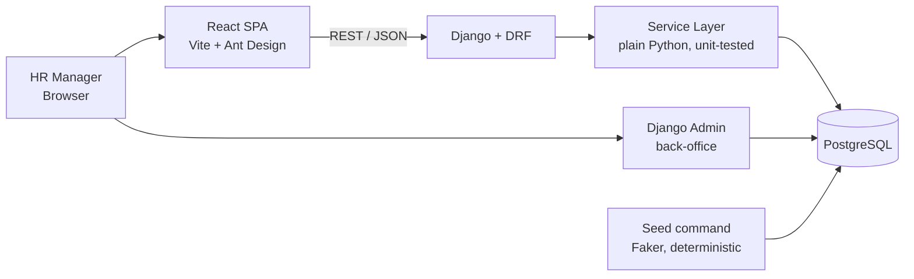
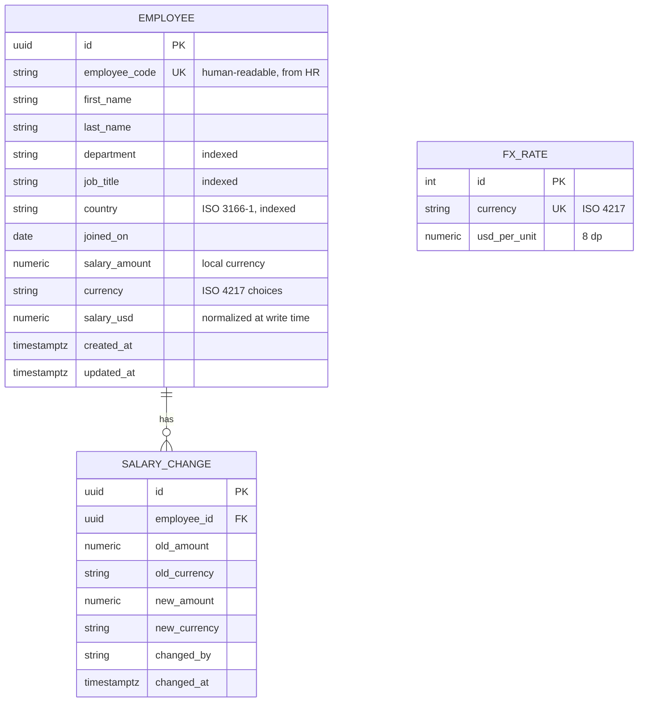

# Architecture — ACME Salary Management

**Author:** Kunal Kejriwal · **Status:** Living document · **Scope:** Take-home assessment (Incubyte)

This document explains what the system looks like, why each decision was made, and what was deliberately *not* built. Companion docs: `REQUIREMENTS.md` (scope), `DECISIONS.md` (trade-off log), `AI_USAGE.md` (AI workflow).

---

## 1. System Overview

A single-tenant web application for ACME's HR manager to manage salary data for ~10,000 employees across multiple countries, replacing an Excel-based workflow.



**Principle applied throughout: simplest architecture that honestly serves the load.** 10,000 employees is small data. Every component below exists because the product needs it — scaling paths are documented (§8), not pre-built.

---

## 2. Stack & Rationale

| Layer | Choice | Why |
|---|---|---|
| Backend | Python 3.12+, Django 5 + Django REST Framework | Matches the role; batteries included — ORM, migrations, auth, and admin come from one coherent framework instead of assembled parts |
| Database | PostgreSQL in production, SQLite for development and tests | Real aggregates power analytics; SQLite keeps the suite fast and dependency-free |
| Frontend | React 18 + Vite + TypeScript | Matches the role; fast dev loop |
| Components | Ant Design | Data-dense HR UI: Table with server-side pagination/sort/filter and charts (`@ant-design/plots`) out of the box |
| Deployment | Railway (API + managed Postgres), Vercel (SPA) | Public URL with minimal ops surface, no container layer to maintain |

A deliberate side benefit of Django: the **built-in admin** gives a zero-cost back-office over employees and the salary audit trail. It is also the HR manager's credential — since bespoke authentication is out of scope (§8), the admin login is the one account that exists.

---

## 3. Data Model



Key modeling decisions:

- **Money is `DecimalField`, never float.** Non-negotiable for salary data.
- **Dual salary storage** — `salary_amount` + `currency` is the source of truth; `salary_usd` is computed at write time from a static FX table (`fx_rates` seeded in-repo). This makes every cross-country aggregate a plain ORM aggregation with no join-time conversion, at the cost of a documented staleness trade-off (§8). It is also what makes a salary *range filter* meaningful across currencies.
- **`salary_change` is an append-only audit trail**, written by the service layer on every salary update. Currency is recorded on **both sides**: a move from 100,000 INR to 2,000 USD is a raise, and a single currency column would make it read as a 98% cut.
- **`salary_usd` is `NOT NULL` with no default**, so a write that bypasses the service layer fails loudly rather than storing a silent zero.

---

## 4. API Design

REST via DRF, versioned under `/api/v1`, browsable API in dev, OpenAPI schema via `drf-spectacular` at `/api/schema`, Swagger UI at `/api/docs`.

| Endpoint | Purpose |
|---|---|
| `GET /employees` | Server-side pagination, ordering, and filters (`country`, `department`, `job_title`, `currency`, `salary_usd` range, free-text search) via `django-filter` |
| `POST /employees` · `GET/PUT/PATCH/DELETE /employees/{id}` | CRUD; salary updates append to `salary_change` |
| `GET /employees/{id}/salary-history` | Audit trail for one employee |
| `GET /analytics/summary` | Headcount, total annual cost, average, median (USD) |
| `GET /analytics/by-country` · `/by-department` · `/by-title` | Headcount, average, median, min, max per group (USD), ordered by headcount |

All analytics figures are expressed in USD, the reporting currency. The API is UI-agnostic by design — a future payroll/HRIS integration consumes the same endpoints.

---

## 5. Backend Structure

```
config/               # settings (base/dev/prod/test), urls, wsgi, asgi
apps/
  core/               # currencies, fx_rates, to_usd, seed command
  employees/          # models, serializers, views, filters, services.py
  analytics/          # aggregate queries behind service functions
  */tests/            # unit + API tests colocated per app
scripts/benchmark.py  # reproducible performance measurements
```

DRF views stay thin; business logic (audit writes, salary normalization, analytics queries) lives in `services.py` modules that take plain data and querysets. This is what keeps tests fast and the TDD loop tight.

Two rules that shape the code more than any other:

- **The service layer is the only supported write path.** The audit row is written explicitly in `update_employee`, not by a signal or a `save()` override — a model hook fires on fixtures and migrations, does *not* fire on `bulk_create`, and hides the write from the call site. Tests assert the negative: a direct `save()` writes no audit row.
- **Strict underneath, forgiving at the edge.** `core.to_usd` rejects a lowercase currency code; the serializer normalizes `"inr"` to `"INR"` before it gets there.

Seeding is a management command: `python manage.py seed --count 10000`, deterministic given a seed.

---

## 6. Testing Strategy

Built test-first; commit history shows red → green → refactor.

- **Fast & deterministic:** `pytest-django` with an in-memory SQLite test DB, fixed seeds, no network, no sleeps. Full suite target: under 10 seconds.
- **Coverage priorities:** currency normalization and Decimal precision, the salary-update audit trail, list pagination/filter/search/ordering edges, analytics aggregates against hand-computed fixtures, seed determinism and realism.
- **API tests** via DRF's `APIClient` for contract-level checks; **frontend** gets targeted Vitest + Testing Library coverage on the employee table, the detail/history flow, and the salary edit.
- **Tests are checked for discriminating power.** Where an assertion could plausibly pass against a broken implementation, the implementation was temporarily broken to confirm the test fails. Recorded per case in `DECISIONS.md`.
- One known trade-off: SQLite lacks `percentile_cont`, so median analytics use a portable expression tested against fixtures.

---

## 7. Performance Considerations

- **Server-side pagination everywhere** — the browser never receives 10k rows.
- **Indexes** on `country`, `department`, `job_title`, `(last_name, first_name)`, `employee_code`; analytics group-bys hit indexed columns.
- **Every ordering is total.** A tiebreaker on `id` is appended to every sort, because ordering by a non-unique column lets rows straddle a page boundary and appear twice or not at all.
- **Batched writes** for the seed — `bulk_create(batch_size=1000)`.
- **Seed realism:** salaries drawn log-normal per country *and job title*, in local currency, so distributions and dashboards look like a real org.
- **Measured, not claimed.** `DECISIONS.md` carries a timing table at 10,000 records, reproducible via `scripts/benchmark.py`. Every list scenario lands in single-digit to low-double-digit milliseconds at a flat query count, which is why no caching layer is warranted (§8).

---

## 8. Deliberately Out of Scope — and the Evolution Path

| Not built | Why | When it becomes right |
|---|---|---|
| **Authentication, login page, RBAC** | Scoped out by the Incubyte team: the app is internal and the user is an already-authorized single HR manager. The Django admin login is the credential that exists | SSO/IdP at the edge, then Django groups and permissions enforced in the service layer once a second persona exists |
| **CSV bulk import** | Team guidance: not expected — a deterministic seed covers the 10,000 records. Cut to keep the core polished | *Stretch path:* stream-parse the upload, validate row by row, insert valid rows with `bulk_create`, and record per-row failures so a partial load reports what landed and what did not. Beyond ~1M rows it moves behind a queue with presigned upload and status polling |
| **CSV export** | Same call: breadth traded for a polished core | A streaming response over the same filterset the list view already uses |
| Employee self-service | One persona in scope | `/me` endpoints on the same UI-agnostic API |
| Live FX rates | Static table is deterministic, testable, and honest for a demo | Daily rate ingestion + effective-dated `fx_rates`, recompute `salary_usd` on rate change |
| Containerization | No container layer to maintain for a single process and one managed database | Multi-service deployment, or a team needing byte-identical local environments |
| Payroll execution / payslips | Managing salary data is not paying people | Separate bounded context; integrate via the existing API |
| Caching / read replicas | Every query is milliseconds at this scale, with evidence (§7) | ~1M+ employees or heavy concurrent analytics |

---

## 9. Deployment

- **Local:** `pip install -r requirements/dev.txt`, `manage.py migrate`, `manage.py seed`, `manage.py runserver`. SQLite by default — no external services, no containers. Set `DATABASE_URL` to run against Postgres.
- **Prod:** Railway (Gunicorn + managed Postgres; `migrate` and `seed` as the release command), Vercel (SPA). Environment-driven config (`DJANGO_SECRET_KEY`, `DATABASE_URL`, `ALLOWED_HOSTS`, `CORS_ALLOWED_ORIGINS`); no secrets in the repo.
- **Back-office:** `/admin`, reached with a superuser created at deploy time. This is the HR manager's way in.
